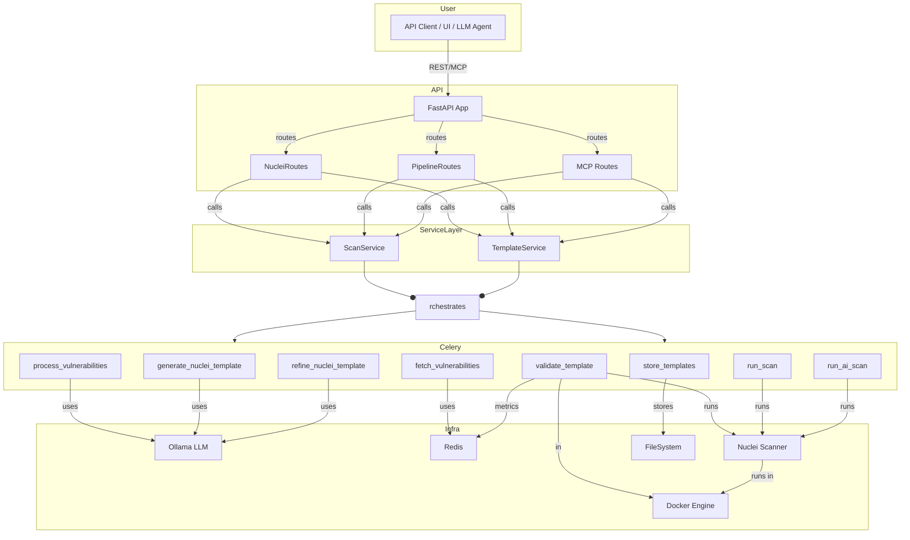
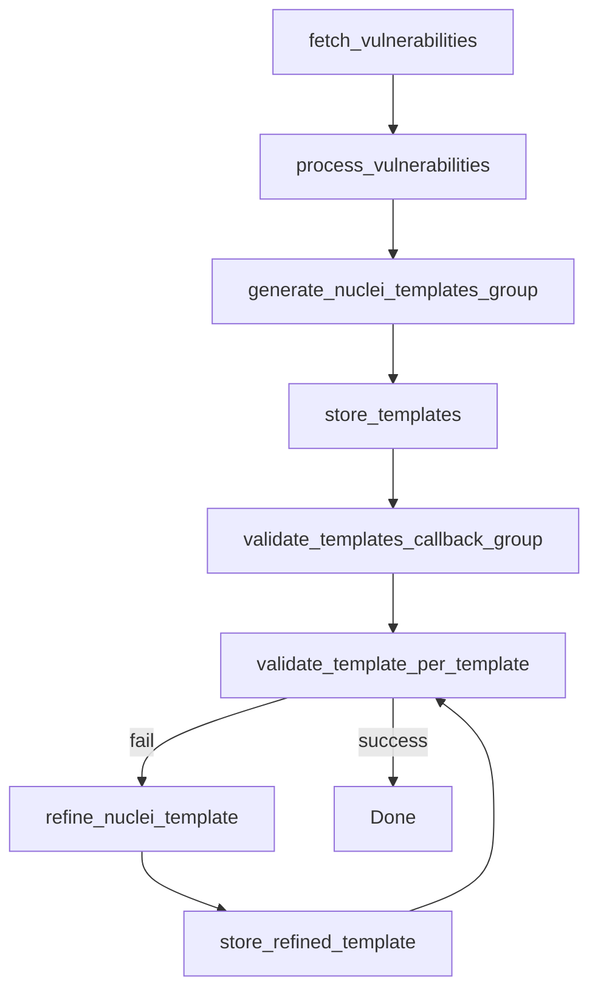

# Nuclei API: Automated Vulnerability Template Generation & Scanning Platform

## Overview

**Nuclei API** is an advanced, AI-augmented platform for automated vulnerability scanning and template management, built around [Nuclei](https://nuclei.projectdiscovery.io/). It provides a REST API for running scans, managing templates, and orchestrating a pipeline that fetches new vulnerabilities, generates detection templates using an LLM, validates them, and refines them as needed. The system leverages FastAPI, Celery, Redis, Docker, and Ollama (LLM) to deliver scalable, intelligent, and automated security scanning.

---

## Key Features

- **Automated CVE Template Generation:**  
  Fetches recent vulnerabilities (CVEs) from public sources and uses an LLM to generate Nuclei YAML templates for each.
- **Template Validation & Refinement:**  
  Validates generated templates by running them against known vulnerable hosts. If validation fails, templates are refined using the LLM and retried.
- **Flexible Scanning API:**  
  Exposes endpoints to run Nuclei scans on targets (IP/domain), with support for custom templates, AI-generated templates, and standard templates.
- **Asynchronous Pipeline:**  
  Uses Celery for distributed, asynchronous task orchestration (fetching, generating, validating, refining).
- **Metrics & Caching:**  
  Uses Redis for caching vulnerability data and tracking pipeline metrics.
- **Containerized Scanning:**  
  Runs Nuclei scans in Docker containers for isolation and resource control.
- **Custom Template Support:**  
  Upload and use your own Nuclei templates.
- **Real-Time Log Streaming:**  
  Stream scan logs directly from running Docker containers.
- **Extensible & Modular:**  
  Modular controllers for Docker, Nuclei, Fingerprinting, and Templates.

---

## Architecture



### Description

- **User/Agent**: Interacts via REST or MCP endpoints (for LLM/agent integration).
- **API Layer**: Modular FastAPI routers:
  - `NucleiRoutes` (scanning, template management)
  - `PipelineRoutes` (pipeline/metrics)
  - `MCP Routes` (LLM/agent tool manifest and tool-calls)
- **Service Layer**: `ScanService`, `TemplateService` encapsulate business logic, orchestrate Celery pipelines, and interact with controllers.
- **Celery Tasks**: Handle async, distributed work (fetch, generate, validate, scan, refine).
- **Controllers**: Stateless adapters for Docker, Nuclei, etc. (not shown in diagram for brevity).
- **Models**: Pydantic models for all API and internal data.
- **Infrastructure**: Redis (cache/metrics), Docker (isolation), Ollama LLM (template generation/refinement), Nuclei (scanning), FileSystem (template storage).

### API Structure

- `app/api/NucleiRoutes.py` — main scan/template endpoints
- `app/api/PipelineRoutes.py` — pipeline/metrics endpoints
- `app/api/mcp_routes.py` — MCP endpoints for LLM/agent integration
- `app/services/` — business logic
- `app/models/` — Pydantic models
- `app/celery_tasks/` — Celery task definitions
- `app/controllers/` — external system adapters

---

## Pipeline Flow



---

## Setup Instructions

### Prerequisites

- **Python 3.8+**
- **Docker & Docker Compose**
- **Redis**
- **Ollama (or compatible LLM API)**
- *(Optional)* **Node.js & npm** (if using the UI)

### Clone the Repository

```sh
git clone <repository-url>
cd nuclei-api
```

### Install Python Dependencies

```sh
pip install -r requirements.txt
```

### Clone Nuclei Templates

```sh
git clone https://github.com/projectdiscovery/nuclei-templates.git
```

### Start Redis and Ollama

You can use Docker Compose to start all services (API, Redis, Ollama, etc.):

```sh
docker-compose up -d
```

Or start them individually as needed.

### Run the API

```sh
cd app/
python3 main.py
```

The API will be available at `http://localhost:8080`.

---

## Usage Examples

### 1. **Trigger the Automated Template Generation Pipeline**

```sh
curl -X GET http://localhost:8080/nuclei/template/generate
```
This will fetch new CVEs, generate templates using the LLM, store, and validate them.

### 2. **Run a Scan (API)**

#### Basic Scan

```sh
curl -X POST \
  -H "Content-Type: application/json" \
  -d '{ "target": "https://example.com", "templates": ["cves/"] }' \
  http://localhost:8080/nuclei/scan
```

#### Custom Template Scan

```sh
curl -X POST \
  -F "target=https://example.com" \
  -F "template_file=@/path/to/custom-template.yaml" \
  http://localhost:8080/nuclei/scan/custom
```

#### Fetch Scan Logs

```sh
curl http://localhost:8080/nuclei/scan/nuclei_scan_123456/logs
```

---

## API Endpoints

### Health Check

- **GET /**  
  Returns `{ "ping": "pong!" }`

### Run a Scan

- **POST /nuclei/scan**  
  Request:
  ```json
  {
    "target": "https://example.com",
    "templates": ["cves/"] // Optional
  }
  ```
  Response:  
  Returns scan result or task ID for async scans.

### Run a Custom Scan

- **POST /nuclei/scan/custom**  
  Form Data:
    - `target`: The target domain or IP to scan.
    - `template_file`: Custom template YAML file (optional).
    - `templates`: Comma-separated list of templates (optional).

### Get Scan Logs

- **GET /nuclei/scan/{container_id}/logs**  
  Streams logs from the running scan container.

### Upload a Custom Template

- **POST /nuclei/template/upload**  
  Upload and validate a custom Nuclei template.

### Scan with Custom Template

- **POST /nuclei/scan/custom-template**  
  Run a scan with a custom template file provided by the user.
  
  Request:
  ```json
  {
    "target": "https://example.com",
    "template_file": "base64_encoded_yaml_content",
    "template_filename": "custom-template.yaml"
  }
  ```
  
  Example with curl:
  ```sh
  # First, encode your YAML template
  TEMPLATE_B64=$(base64 -w 0 /path/to/your/template.yaml)
  
  curl -X POST \
    -H "Content-Type: application/json" \
    -d "{
      \"target\": \"https://example.com\",
      \"template_file\": \"$TEMPLATE_B64\",
      \"template_filename\": \"my-custom-template.yaml\"
    }" \
    http://localhost:8080/nuclei/scan/custom-template
  ```

### Trigger Template Generation Pipeline

- **GET /nuclei/template/generate**  
  Starts the full CVE-to-template pipeline.

---

## MCP (Model Context Protocol) Endpoints

The API exposes endpoints for LLM/agent integration via the Model Context Protocol (MCP):

- **GET /v1/tools**  
  Returns a manifest of all available tools (API actions) and their argument schemas, for agent/LLM discovery.

- **POST /v1/tool-calls**  
  Allows an agent or LLM to invoke any supported tool by name, passing arguments as a JSON object. Returns the result or error.

**Example:**
```sh
curl -X POST \
  -H "Content-Type: application/json" \
  -d '{ "tool_name": "nuclei_scan", "arguments": { "target": "https://example.com" } }' \
  http://localhost:8080/v1/tool-calls
```

The MCP endpoints are implemented in `app/api/mcp_routes.py` and registered in `main.py`.

---

## API Structure & Organization

- **app/api/NucleiRoutes.py**: Main Nuclei scan/template API endpoints
- **app/api/PipelineRoutes.py**: Pipeline and metrics endpoints
- **app/api/mcp_routes.py**: MCP endpoints for LLM/agent integration
- **app/services/**: Business logic and orchestration
- **app/models/**: Pydantic models for request/response validation
- **app/celery_tasks/**: Celery task definitions
- **app/controllers/**: Stateless controllers for external systems (Docker, Nuclei, etc.)

Routers are imported and registered in `main.py` using the new import paths (e.g., `from app.api.NucleiRoutes import router as nuclei_router`).

---

## Metrics & Monitoring

- **Redis** is used for caching vulnerability data and tracking pipeline metrics (templates generated, validated, refinements, failures, etc.).
- **Sentry** integration is available for error monitoring (configure via environment).

---

## Extending & Customizing

- **Add new vulnerability sources** by editing the `fetch_vulnerabilities` task.
- **Change LLM model or endpoint** via configuration.
- **Integrate with your own UI** or use the provided API directly.

---

## Contributing

Contributions are welcome! Please open issues or pull requests for bug fixes, new features, or improvements.

---

## License

[MIT](LICENSE) or as specified in the repository.

---

## Contact

For more details or support, please contact the development team.
